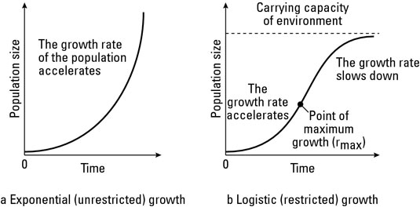

## Abstract

## Introduction

Our main question of interest for this exploratory data analysis is whether or not there is a difference in the 200 day cumulative new case growth rate   amongst WHO (World Health Organization) member countries that had implemented a mask mandate, testing, lockdown policy, and/or restaurant closure mandate, versus those that didn’t implement all or part of these policies during that timeframe. The 200 day period that will be examined for each country will start from the day of the 1st confirmed new case of COVID-19. Furthermore, only those countries that recorded at least 800 new cases in the first 100 days of data collection were included as part of this data analysis. This restriction was implemented due to the fact that countries falling outside this range may have too few cases to be able to accurately judge if any relationship is present between the aforementioned enacted policies and new case growth.

The results of this data analysis could better inform us on the effectiveness of mask, testing, and other public policies in stemming the spread of COVID-19. In turn, this information could have significant public policy implications as countries decide whether or not to implement mask mandates, introduce more widespread testing, mandate restaurant closures, and/or enact lockdowns for their citizens to combat the COVID-19 pandemic. The results of this analysis can be used to build political and public support either for or against these measures based on its results. Additionally, if such policies are shown to be effective in stemming the spread of COVID-19, this analysis would allow researchers to better forecast the impact of COVID-19 on countries based on whether or not they had implemented the mentioned policies.

We will be examining two datasets in this report. One was produced by the World Health Organization (WHO) regarding the COVID-19 pandemic. This dataset features the following variables of interest: number of new COVID cases, deaths attributable to COVID-19, and a cumulative measure of both data points since January 3rd, 2020 until the present. Data has been compiled from all countries that are members of the WHO. The second dataset was published in the journal Nature and includes data from the European Center for Disease Prevention and Control, Oxford, and other sources. This particular dataset examines the response of governments to COVID-19. Some of the key variables from this dataset that will be relied on for this report include: obligation to wear masks (binary value tracking whether or not mask mandate is in place), testing policy (binary value tracking whether or not a public testing policy is in place), number of new cases reported each day for each respective country, etc.

At the onset, we hypothesize that because masks prevent air from flowing between persons, they will be effective in reducing the transmission of COVID-19 amongst a population. Therefore, we expect to see that countries that implemented the mask mandate during the 200 day timeframe will have a lower cumulative new case growth rate versus countries that did not implement such policies until after the mentioned timeframe. Furthermore, having a public testing policy would allow COVID-19 cases to be caught early on so that people can go into isolation and minimize their likelihood of spreading the virus to their peers. Instituting a lockdown and/or laws requiring restaurant closures would be expected to have a similar impact due to the fact that they also restrict people from interacting with one another and encourage isolation. So it can also be hypothesized that countries with public testing policies, a lockdown in place, and/or laws mandating restaurant closures may have a lower cumulative new case growth rate over the 200 days in question.

## Background

As previously mentioned, two datasets were used in the creation of this analysis. The first such dataset was obtained from the WHO and featured variables pertaining to new cases of COVID-19 infections as well as deaths attributable to the virus. As aforementioned, this data had been harvested since January 3rd 2020 up to the present. The WHO went about obtaining the information needed for this dataset by collecting data via official communications, which were conducted per International Health Regulations, and supplemented this with data reported by countries’ governmental health agencies (this includes any information disclosed by these agencies on their websites and social media channels). During this process, the number of new cases and deaths catalogued were only recorded if these cases were laboratory-confirmed and fell within the WHO's definitions for confirmed cases of COVID-19. Specifically, in order to be classified as a new case of COVID-19, a person would have to have a positive Nucleic Acid Amplification Test result and/or be identified as being positive for the SARS-CoV-2 Antigen. Additional data apart from that reported by member countries was obtained from the European Center for Disease Prevention and Control. Possible sources of bias in the WHO dataset may include: bias on the part of health ministries in WHO member countries when reporting their data, lack of accurate reporting from WHO member countries with underdeveloped health systems and a lack of significant healthcare infrastructure, bias in the AI web-scraping algorithm used to harvest data from public press releases and social media posts made by governmental health agencies, etc.


The second dataset was obtained from the University of Oxford’s COVID-19 Government response tracker and features several variables documenting the governmental response of countries to the COVID-19 pandemic. In total, 13 public health measures and 7 measures of economic policy were catalogued in this dataset. Each of these measures were assessed with a binary datapoint (1 or 0) depending on whether or not the policy indicated had been implemented by the country in question. In a few cases, a measure of “0.5” was used to denote partial implementation of a particular policy. Those of particular interest for this analysis included: obligation to wear masks in public settings, whether or not a public testing policy was in place, whether or not a domestic lockdown had been initiated, and whether restaurant closures had been mandated. Data for each of the public health measures catalogued by the dataset were obtained from the Assessment Capacities Project (ACAPs), the International Monetary Fund (IMF), and from information made publicly available by countries’ governmental health agencies. Possible sources of bias in this dataset may include: bias on the part of governmental health agencies when publicly disclosing information about their policy responses to COVID-19, lack of coordinated policy measures implemented by countries with weakly structured governments, etc.

Citation: Hale, Thomas, Noam Angrist, Emily Cameron-Blake, Laura Hallas, Beatriz Kira, Saptarshi Majumdar, Anna Petherick, Toby Phillips, Helen Tatlow, Samuel Webster (2020). Oxford COVID-19 Government Response Tracker, Blavatnik School of Government.


Existing research published in the American Journal of Tropical Medicine and Hygiene as well as by the National Academy of Sciences in the United States has shown that COVID-19 transmission rates are forecasted to be 7.5 times higher in countries without a mask mandate as opposed to countries with one in place. And as expected, countries with a mask mandate have a lower COVID-19 related mortality rate than those that have not implemented such policies. Additionally, it was observed that the duration of time spent in lockdown was inversely correlated with COVID-19 related mortality rate, which is also in line with expectations. On the other hand, increased public testing for COVID-19 was shown to not have a statistically significant relationship with COVID-19 related mortality rate. 

Citation: Leffler, Christoper T, et al. “Association of Country-Wide Coronavirus Mortality with Demographics, Testing, Lockdowns, and Public Wearing of Masks.” The American Journal of Tropical Medicine and Hygiene, vol. 103, no. 6, 13 Aug. 2020, pp. 2400–2411., doi:https://doi.org/10.4269/ajtmh.20-1015. 


## Decriptive Analysis
```{r setup, include=FALSE}
knitr::opts_chunk$set(echo = FALSE, message = FALSE, warning=FALSE)
library(tidyverse)
library(readxl)
library(dplyr)
library(ggplot2)
library(stats)
library(reshape2)
library(growthcurver)
library(stringr)
library(anytime)
```


```{r, echo=FALSE}
covid <- read_csv("https://covid19.who.int/WHO-COVID-19-global-data.csv")

policy <- read_excel("Data/Gov_Responses2Covid19_last.xlsx")


### CHANGE DATES IN POLICY TO PROPER FORMAT ###
for (x in 1:nrow(policy)) {
  if (nchar(policy$d[x])==9) {
    policy$d[x]=as.character(anydate(policy$d[x]))
  }
  else {
    policy$d[x]=as.character(as.Date(as.numeric(policy$d[x]), origin="1899-12-30"))
  }
}

```

```{r, echo=FALSE}
policy$d<-as.Date(policy$d)
##############################################################################################################
### CREATE DF WHICH TRACKS CUMULATIVE CASES OVER FIRST 200 DAYS SINCE FIRST RECORDED CASE FOR EACH COUNTRY ###
dat.200days<-data.frame(days<-(0:200))


for (x in 1:nrow(covid)) {
  
  if (covid$Cumulative_cases[x]!=0 && covid$Cumulative_cases[x-1]==0 & covid$Cumulative_cases[x+100]>800) {
    country<-covid$Country_code[x]
    date<-covid$Date_reported[(x+0):(x+200)]
    cases<-covid$Cumulative_cases[(x+0):(x+200)]
    dat.200days[,paste0(country)]<-cases
    dat.200days[,paste0(country, ' date')]<-covid$Date_reported[(x+0):(x+200)]
    
    #try<-subset(policy, policy$d %in% as.character(covid$Date_reported[(x+0):(x+200)]))
  }
  
}
###Thus r is the maximum theoretical rate of increase of a population per individual – that is, the maximum population growth rate. The concept is commonly used in insect population ecology or management to determine how environmental factors affect the rate at which pest populations increase. See also exponential population growth and logistic population growth.[18]   https://en.wikipedia.org/wiki/Population_dynamics###


### CREATE DF FOR GROWTH RATES BY COUNTRY ###
covid.x<-(0:200)
dat.growthrates<-data.frame(country=unique(names(dat.200days))[seq(2,length(dat.200days),2)], gr=0, days_testing=0, days_mask=0, days_lockdown=0, days_restaurant_close=0)
n<-length(names(dat.200days))
country.name<-names(dat.200days)
for (x in seq(2,n,2)) {

 if (str_sub(country.name[x], start=-4)!='date') {
  gc_fit<-SummarizeGrowth(covid.x,dat.200days[,x])
 
  dat.growthrates$gr[x/2]<-gc_fit$vals[7]
  dat.growthrates$days_testing[x/2]<-sum(policy$testing[policy$d >= dat.200days[1,x+1] & policy$d <= dat.200days[201,x+1] & policy$geoid==names(dat.200days)[x]])
  dat.growthrates$days_mask[x/2]<-sum(policy$masks[policy$d >= dat.200days[1,x+1] & policy$d <= dat.200days[201,x+1] & policy$geoid==names(dat.200days)[x]])
  dat.growthrates$days_lockdown[x/2]<-sum(policy$domestic[policy$d >= dat.200days[1,x+1] & policy$d <= dat.200days[201,x+1] & policy$geoid==names(dat.200days)[x]])
  dat.growthrates$days_restaurant_close[x/2]<-sum(policy$rest[policy$d >= dat.200days[1,x+1] & policy$d <= dat.200days[201,x+1] &policy$geoid==names(dat.200days)[x]])
 }
}
### OMIT CHINA OUTLIER ###################################################################################
test.data<-dat.growthrates[-c(26, 91, 59),]
```


A good way of measuring the spread of COVID-19 across a range of time is through logistic growth modeling (insert citation of study). Logistic growth is commonly used in fields like biology and ecology to model the growth of populations in an environment. The logistic growth equation used here (from the R package "growthcurver") takes the form of:

$$N_t = \frac{K}{1 + \left( \frac{K-N_0}{N_0} \right) e^{-rt}} $$
Where $N_t$ describes the number of cumulative cases at time $t$. The parameter $K$ is the theoretical maximum possible population size, which in this context describes the theoretical carrying capacity of COVID-19 cases in a given country. The parameter $N_0$ is the theoretical number of cumulative cases on day 0 for the fitted growth curve. Lastly, the parameter $r$ is known as the intrinsic growth rate. It can be thought of as the maximum theoretical rate of increase of the number of cases per individual. That is to say, r represents the growth rate which would be observed were there to be no natural limitations imposed on the carrying capacity of COVID-19 cases in a given country. It represents the maximum theoretical per capita growth rate within the population. 





The R package "growthcurver" finds optimal values of $K$, $r$, and $N_0$ in order to find a nonlinear line of best fit. We can see some fitted logistic growth curves for some countries below. 


``` {r, echo=FALSE}
#############################################################################################################
### OBTAIN LOGISTIC GROWTH FOR ANY COUNTRY ###

gc_fit<-SummarizeGrowth(covid.x,dat.200days[,"US"])
plot(gc_fit, lwd=3, main= paste("United States First 200 Days, r = ",gc_fit$vals[7]))

gc_fit2<-SummarizeGrowth(covid.x,dat.200days[,'AZ'])
plot(gc_fit2, lwd=3, main=paste("Azerbaijan First 200 Days, r = ",gc_fit2$vals[7]))

gc_fit3<-SummarizeGrowth(covid.x,dat.200days[,'BO'])

plot(gc_fit3, lwd=3, main=paste("Bolivia First 200 Days, r = ",gc_fit3$vals[7]))

gc_fit4<-gc_fit3<-SummarizeGrowth(covid.x,dat.200days[,'NZ'])
plot(gc_fit3, lwd=3, main=paste("New Zealand First 200 Days, r = ",gc_fit4$vals[7]))

```


We can also observe the parameters which the growthcurver package fits to each country. For Denmark, for example, we obtain the parameters shown in the output below. Note that r, intrinsic growth rate, is reported as 0.087. This implies that the theoretical maximum rate of spread of COVID-19 in Denmark over the initial 200 day period was 0.087. Each person in the country would be expected to spread the disease to 0.087 other people during the height of contagion.  
```{r, echo=FALSE}
gc_fit5<-SummarizeGrowth(covid.x,dat.200days[,'DE'])
gc_fit5
```


Visualizing a histogram of the number of days in which a mask mandate was in place may also shed insight into how different countries chose to respond to the initial onset of the virus. From the histogram, we observe that although the majority of countries implemented mask mandates for more than 100 days of the initial 200 day period, there were still a handful of countries which implemented very few days of mask mandates and/or none at all. 


```{r, echo=FALSE}
### OBTAIN HISTOGRAM OF NUMBER OF DAYS WITH MASK POLICY ###


hist(dat.growthrates$days_mask, main='Histogram of Days with Mask Mandate by Country (First 200 Days)',
     xlab='Days with Mask Mandate', ylab='Number of Countries')
```

Here we can visualize 200 day growthrates based on the number of days mask mandates and lockdown policies were implemented in given countries. 


```{r, echo=FALSE}
### SCATTERPLOTS ###

ggplot(data=dat.growthrates, aes(x=as.numeric(days_mask), y=as.numeric(gr),label=country)) + geom_point() + scale_x_discrete() + geom_text(aes(label=ifelse(gr>.08,country,'')), size=3,hjust=0,vjust=0,color='blue') + xlab('Days With Mask Policy') +
ylab('200 Day Growth Rate') + ggtitle('200 Day Growth Rate Based on Days with Mask Policy') + xlim(0,200)

ggplot(data=dat.growthrates, aes(x=as.numeric(days_lockdown), y=as.numeric(gr),label=country)) + geom_point() + scale_x_discrete() + geom_text(aes(label=ifelse(gr>.08,country,'')), size=3,hjust=0,vjust=0,color='blue') + xlab('Days With Lockdown Policy') +
ylab('200 Day Growth Rate') + ggtitle('200 Day Growth Rate Based on Days with Lockdown Policy') + xlim(0,200)
```


Here we obtain boxplots of the 200 day logistic growth rate recorded for countries which implemented less than 100 days of certain policy measures and more than 100 days of certain policy measures within the 200 day time period. 


```{r, echo=FALSE}
### BOXPLOTS ###

to.plot.lessmasks<-dat.growthrates$gr[which(dat.growthrates$days_mask<100)]

to.plot.moremasks<-dat.growthrates$gr[which(dat.growthrates$days_mask>=100)]

boxplot(unlist(to.plot.lessmasks),
        unlist(to.plot.moremasks),
        names=c('Less than 100 Days of Masks (n=35)', 'More than 100 Days (n=97)'),
        main='200 Day Logistic Growth Rate by Days of Mask Mandate')

to.plot.lesslockdown<-dat.growthrates$gr[which(dat.growthrates$days_lockdown<100)]

to.plot.morelockdown<-dat.growthrates$gr[which(dat.growthrates$days_lockdown>=100)]

boxplot(unlist(to.plot.lesslockdown),
        unlist(to.plot.morelockdown),
        names=c('Less than 100 Days (n=111)', 'More than 100 Days (n=25)'),
        main='200 Day Logistic Growth Rate by Days of Lockdown')

summary(unlist(to.plot.lesslockdown))
summary(unlist(to.plot.morelockdown))
summary(unlist(to.plot.lessmasks))
summary(unlist(to.plot.moremasks))
```

```{r, echo=FALSE}
by_country <- policy %>%
  group_by(country)

policy2 <- by_country %>%
  subset(d=='2020-08-31' | d=='2020-04-01')


covid2 <- covid %>%
  subset(Date_reported=='2020-08-31' | Date_reported=='2020-04-01') 

policy2$date<-as.Date(policy2$d, "%Y-%m-%d")

policy2<-policy2 %>%
  subset(select=-c(d))

df<-merge(x=policy2, y=covid2, by.x=c("geoid", "date"), by.y=c("Country_code", "Date_reported"))
df<-df %>%
  mutate(case_proportion=(Cumulative_cases/as.numeric(population_2019))) 

```


Note that the `echo = FALSE` parameter was added to the code chunk to prevent printing of the R code that generated the plot.


Adding case mortality column
```{r, echo=FALSE}
df$Case_mort = df$Cumulative_deaths/df$Cumulative_cases
```


```{r, echo=FALSE}
### CREATE VARIABLE FOR CASE GROWTH RATE BETWEEN APRIL 01 AND AUGUST 31 ###
#for (country in 1:nrow(df)) {
  
 # df$growth2[country]<-log(((df$Cumulative_cases[country+1])-(df$Cumulative_cases[country]))/(df$Cumulative_cases[country]))
#}

#na.index<-is.na(df$growth2)
#inf.index<-is.infinite(df$growth2)
#nan.index<-is.nan(df$growth2)
#df.growthrates<-df[!na.index & !inf.index & !nan.index,]
```


## Inferential Analysis
Our primary question of interest is whether certain policies enacted at the national and sub-national level may be associated with different outcomes in the 200 day growth rate of cumulative new cases of COVID-19 as measured by a fitted logistic growth curve. The policies we have examined include mask wearing obligations, testing implementation, lockdown enforcement, and mandatory restaurant closures.  In the Oxford dataset, which tracks daily COVID-19 cases as well as daily policy implementations through the use of indicator variables, we obtained the sum of the total number of days in which policy measures were in place over the 200 day period. Each policy indicator variable took a value of 1 if the given policy was implemented at the national or sub-national level on that day, and 0 if the policy was not enacted at both the national and sub-national level. The 200 day period is defined here with day 1 being the date on which the first case was recorded in the given country. This was done so as to ensure that measurement of growth rate was consistent for all countries in question. Although we should note that this approach fails to take into account other relevant factors, such as seasonal climate and population density. 


The dataset which is implemented in the model contains 127 observations. In order to increase the reliability of the model, we decided to only take into account countries which recorded at least 800 cases by the 100th day after initial infection. We found that countries below this threshold tended to report numbers which were inconsistent enough (i.e. large jumps or gaps in reported data) to cause the fitted logistic growth curves to be unrepresentative of the actual spread of the disease. After doing this, we were left with 138 observations (countries) in total.


It is important to emphasize that the goal of this model is not to assess causality, but to determine what policy measures, if any, are associated with different outcomes in terms of the country's 200 day logistic growth rate, $r$. 


A secondary question of interest then entails which of these different policies, if any, are associated with COVID-19 logistic growth rates measured over the 200 day interval. 


For the purposes of answering these questions, we employed regression analysis. The outcome variable $Y_i$ is defined as the 200 day logistic growth rate $r$ as determined by a fitted logistic growth curve with the R package 'growthcurver'. The package determines the optimal parameters $K$, $r$, and $N_0$ (see the descriptive analysis section for explanation of these parameters) based on the logistic growth equation:
$$N_t = \frac{K}{1 + \left( \frac{K-N_0}{N_0} \right) e^{-rt}} $$


This equation is commonly used to model population growth of organisms in different environments.


We first employ a linear regression model of the form:

$$Y_{i}=\beta_0+\beta_1x_{1,i}+\beta_2x_{2,i}+\beta_3x_{3,i}+\beta_4x_{4,i} \quad \quad i=1,...,127$$


Where each vector $x_{1,i},...,x_{4,i}$ is the number of days for which the mask, lockdown, testing, and restaurant closure policies were implemented for the i-th country over the 200 day time period. The outcome variable is the parameter $r$ for the i-th country as determined by that country's fitted logistic growth curve over the same 200 day time period. 


The linear regression model relies on several key assumptions. 


1) Linearity: The relationship between the response variable and the predictor variables is linear in parameters. This means that Y can be expressed as a linear combination of the parameters present in the model. 

2) Homoskedasticity: Variance across the error terms is constant for every value of the response variable $Y$

3) Errors are independent and identically distributed: In addition to the assumption of constant variance across residuals, residuals must follow the distribution $\epsilon$~$N(0, \sigma_\epsilon^2)$

4) Variables are measured or observed reliably and without reporting error. 


```{r,echo=FALSE}


model_growth.rate.logistic1<-lm(data=test.data, formula=unlist(gr)~days_mask+days_testing+days_restaurant_close+days_lockdown)


#model_growth.rate.logistic2<-lm(data=dat.growthrates,formula=unlist(gr)~days_mask)
summary(model_growth.rate.logistic1)

coeff<-coefficients(model_growth.rate.logistic1)
na.index<-is.na(test.data$days_mask)
na.index2<-is.na(test.data$days_lockdown)

predicted_df<-data.frame(growth_pred=predict(model_growth.rate.logistic1), days_mask=test.data$days_mask[!na.index & !na.index2])


ggplot(data=test.data, aes(x=as.numeric(days_mask), y=as.numeric(gr),label=country)) + geom_point() + scale_x_discrete() + geom_text(aes(label=ifelse(gr>.07,country,'')), size=3,hjust=0,vjust=0,color='blue') + xlab('Days With Mask Policy') +
ylab('200 Day Growth Rate') + ggtitle('200 Day Growth Rate Based on Days with Mask Policy') + xlim(0,200) +
geom_line(color='red', data=predicted_df, aes(x=as.numeric(days_mask),y=growth_pred), size=1) +
labs(title = paste("Adj R2 = ",signif(summary(model_growth.rate.logistic1)$adj.r.squared, 5)))

ggplot(data=test.data, aes(x=as.numeric(days_lockdown), y=as.numeric(gr),label=country)) + geom_point() + scale_x_discrete() + geom_text(aes(label=ifelse(gr>.07,country,'')), size=3,hjust=0,vjust=0,color='blue') + xlab('Days With Lockdown Policy') +
ylab('200 Day Growth Rate') + ggtitle('200 Day Growth Rate Based on Days with Lockdown Policy') + xlim(0,200) +
geom_line(color='red', data=predicted_df, aes(x=as.numeric(days_mask),y=growth_pred), size=1) +
labs(title = paste("Adj R2 = ",signif(summary(model_growth.rate.logistic1)$adj.r.squared, 5)))


```


```{r, echo=FALSE}
###OTHER TESTS
(confint(model_growth.rate.logistic1, 'days_mask', level=0.95))
#(confint(model_growth.rate.logistic1, 'days_restaurant_close', level=0.95))
```


We find that the model which measures 200 day case growth rate finds mask policies to be significantly associated with the outcome at the $\alpha=0.05$ significance level. In addition, the mask coefficient is negative, suggesting that implementation of mask mandates is associated with a lower 200 day growth rate. 


## Sensitivity Analysis

```{r, echo=FALSE}
# New case growth rate model
plot(model_growth.rate.logistic1,which =1)
```


The residuals versus fitted plot for case growth rate is evenly and randomly spread spread over the line y=0. The spread widen slightly. And we have note the 3 outlier observations 64, 73 and 107. Overall based on this plot the model satisfies linearity and equal varaince of errors assumptions.

```{r, echo=FALSE}
dat.growthrates[26,]
```


### PLOTTING OUTLIERS 
```{r, echo=FALSE}
gc_fit5<-SummarizeGrowth(covid.x,dat.200days[,'CN'])
plot(gc_fit5, lwd=3, main=paste("China First 200 Days, r = ",gc_fit5$vals[7]))
```
```{r, echo=FALSE}
dat.growthrates[59,]
```

```{r, echo=FALSE}
gc_fit6<-SummarizeGrowth(covid.x,dat.200days[,'IS'])
plot(gc_fit6, lwd=3, main=paste("Iceland First 200 Days, r = ",gc_fit6$vals[7]))
```

```{r, echo=FALSE}
dat.growthrates[91,]
```

```{r, echo=FALSE}
gc_fit7<-SummarizeGrowth(covid.x,dat.200days[,'NZ'])
plot(gc_fit6, lwd=3, main=paste("New Zealand First 200 Days, r = ",gc_fit7$vals[7]))
```


```{r, echo=FALSE}
plot(model_growth.rate.logistic1,which =2)
```
    
The Q-Q plot shows the residuals have slightly lighter tail on the left.There are also three outliers creating a heavier tail on the right. They are the same observations we saw in fitted versus residual plot. Two out of three outliers are very close to the line as are the rest of the observations. So the errors are normally distributed. 

```{r, echo=FALSE}
#plot(model_growth.rate.logistic1,which =3)
```


```{r, echo=FALSE}
plot(model_growth.rate.logistic1,which =4)
```


Cook's distance measures the influence certain observations have on distributions. The higher Cook's distance is the more influential the observation is. There are three observations that we noted in the above plots that also have a high Cook's distance. They are observations 64,73 and 107. The Cook's distance associated with these three was much lower than the three previous outliers, (China, Iceland, New Zealand) that were already removed from data. 


```{r, echo=FALSE}
#plot(model_growth.rate.logistic2, which = 1)


#plot(model_growth.rate.logistic2, which = 2)
```


```{r, echo=FALSE}
#plot(model_growth.rate.logistic2, which = 3)
```


```{r, echo=FALSE}
#plot(model_growth.rate.logistic2, which = 4)
```


## Discussion & Conclusion ##

In this report we performed an analysis of two data sets obtained from the World Health Organization and the  University of Oxford’s COVID-19 Government response tracker. Our question of interest is surrounded around the 200 day cumulative new COVID-19 case growth rate for several WHO member countries. Specifically, we want to study the differences in this growth rate amongst countries that implemented mask mandate, testing, lockdown policy, and/or restaurant closures during the 200 day timeframe versus those that didn’t. The key question is if there is a statistically significant difference between the new case growth rates between the two groups.

To answer this question we first presented appropriate plots in the report. Among these plots were box plots that showed that when testing, masks, lockdown procedures, and/or restaurant closure mandates were implemented, the cumulative case growth over the 200 days being studied were much lower than when these policies were not put into place during this timeframe. To test for statistical significance we constructed a multiple variable general linear model to fit our data set. We set the new case proportion growth rate as the response variable, and we set whether masks mandates, testing, lockdown policies and restaurant closures were implemented as the independent variables. This allowed us to statistically assess whether or not the difference in cumulative new case growth rates were significant. We found that testing policy and mask policy were statistically significant at the 10% level, since the p-values < 0.1. Comparatively the restaurant closures were found to be statistically significant at the general 5% level as the p-value < 0.05. Additionally, we see that the coefficient estimate of the “rest” variable came out to be a negative value. This suggests that case growth and restaurant closures are negatively correlated, which means that case growth decreased as restaurant closures increased. To check that our assumptions for the generalized linear model were met, we performed sensitivity analysis on our data. We found that residuals from the model do not have equal variance as the residuals vs fitted plot shows that residuals seem to fan out as the fitted values increase. If the residuals were to truly have equal variance, the errors would be spread out  evenly around the zero line in our plot. It was also observed that the errors in the model are not normally distributed (confirmed using a normal Q-Q plot, which showed a heavy right tail). Another method to check the equal variance assumption was through the scale location plot and we found once again that the standardized pearson residuals drastically fan out and increase as the predicted values increase. 
We also included a residuals vs leverage plot in our report which also shows that the variances of the residuals are not equal as the residuals spread out as the predictive values increase.

 Because our assumptions of equal variances failed for the first model we propose an alternative model for this analysis that features the following factors in relation to the cumulative new cases growth rate: existence of mask mandate, implementation of lockdown, and closure of restaurants and public dining spaces. For this particular model, the residuals vs fitted values plot revealed that the errors did have equal variance, since the spread of the plotted residuals remained evenly spread over line y = 0 save for a handful of few outliers. Additionally, the normal Q-Q plot had a lighter tail than the previous model and did appear to be linear, indicating that the errors were normally distributed.

For future research and policy making, one can create a model where vaccination and immunity data is also taken into consideration and applied into the model. This model would produce more current up to date results as vaccinations have just begun to ramp up around the world, which means that one can hypothesize that new case growth would go down.


